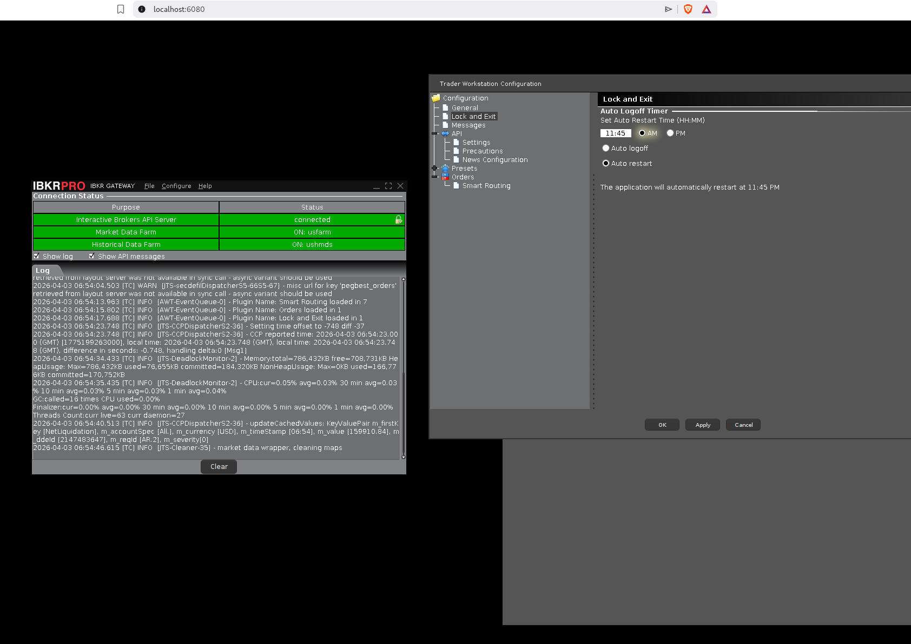

# IB Gateway / TWS in Docker — Multi-Arch (amd64 + arm64)

A fully containerized **IB Gateway** and **Trader Workstation (TWS)** Docker image with multi-architecture support (x86-64 and ARM64/Raspberry Pi), auto-login via [IBC Alpha](https://github.com/IbcAlpha/IBC), and browser-based VNC access via noVNC.

> Based on [extrange/ibkr-docker](https://github.com/extrange/ibkr-docker) as a starting point, refactored for multi-arch support and simplified build architecture.



---

## Features

- **Multi-arch**: runs on both `linux/amd64` (x86 servers) and `linux/arm64` (Raspberry Pi 4/5)
- **Fully containerized** — no external dependencies
- **Auto-login and auto-restart** via [IBC Alpha](https://github.com/IbcAlpha/IBC)
- **Browser VNC access** via noVNC (no VNC client needed)
- **TWS API** automatically configured and forwarded to port `8888`
- Always pulls the **latest stable installer** directly from IBKR

---

## Quick Start

### Using `docker compose` (recommended)

1. Copy `.env.example` to `.env` and fill in your credentials:

```bash
cp .env.example .env
```

```env
USERNAME=your_ibkr_username
PASSWORD=your_ibkr_password
```

2. Start the container:

```bash
docker compose up -d
```

3. Open [http://localhost:6080](http://localhost:6080) in your browser to see the Gateway UI.

4. The TWS API is available at port `8888`.

---

### Using `docker run`

```bash
docker run -d \
  -p "6080:6080" \
  -p "8888:8888" \
  --ulimit nofile=10000 \
  -e USERNAME=your_username \
  -e PASSWORD=your_password \
  -e GATEWAY_OR_TWS=gateway \
  -e IBC_TradingMode=live \
  cslev/ibkr-docker:latest
```

---

## Environment Variables

| Variable               | Description                                                        | Default   |
|------------------------|--------------------------------------------------------------------|-----------|
| `USERNAME`             | IBKR username                                                      | (required)|
| `PASSWORD`             | IBKR password                                                      | (required)|
| `GATEWAY_OR_TWS`       | What to start: `gateway` or `tws`                                  | `tws`     |
| `TWOFA_TIMEOUT_ACTION` | Action on 2FA timeout: `restart` or `exit`                         | `restart` |
| `TWS_SETTINGS_PATH`    | Path inside container to persist TWS settings (see FAQ)            |           |

Variables prefixed with `IBC_` override settings in [IBC Alpha's `config.ini`][config.ini], e.g.:

- `IBC_TradingMode` — `live` or `paper` (default: `live`)
- `IBC_ReadOnlyApi` — `yes` or `no`
- `IBC_ExistingSessionDetectedAction`
- etc.

---

## Docker Image

The image is available on [Docker Hub](https://hub.docker.com/r/cslev/ibkr-docker) as `cslev/ibkr-docker:latest`.

---

## Building Locally

A multi-arch builder must be set up once:

```bash
docker buildx create --name multiarch --driver docker-container --use
docker buildx inspect --bootstrap
```

Build and push to Docker Hub:

```bash
./build.sh latest        # multi-arch build (amd64 + arm64) and push
```

Test locally (amd64 only, no push):

```bash
./build.sh latest --load
```

---

## FAQ

### What is the difference between IB Gateway and TWS?

[TWS][tws] is a full-featured trading platform UI. [IB Gateway][ibgateway] has a minimal GUI and is designed for API-only automated trading — it uses fewer resources. For autotrading, use `GATEWAY_OR_TWS=gateway`.

### What ports are used internally?

| Mode    | TWS  | IB Gateway |
|---------|------|------------|
| Live    | 7496 | 4001       |
| Paper   | 7497 | 4002       |

The container automatically forwards the correct internal port to `8888` based on your `GATEWAY_OR_TWS` and `IBC_TradingMode` settings.

### How do I persist TWS settings across restarts?

The provided `docker-compose.yml` already has this configured — settings are stored in `./tws-settings/` next to your compose file and survive container restarts and image updates:

```yaml
environment:
  - TWS_SETTINGS_PATH=/settings
volumes:
  - ./tws-settings:/settings
```

The `tws-settings/` directory is created automatically by Docker on first run. If you use `docker run` instead, add these flags manually:

```bash
-e TWS_SETTINGS_PATH=/settings \
-v "$PWD/tws-settings:/settings" \
```

### Error: `unable to allocate file descriptor table - out of memory`

Ensure `ulimit nofile` is set: `--ulimit nofile=10000` (docker run) or `ulimits: nofile: 10000` (docker compose).

### Cannot connect to the API when using TWS

Manually enable `Enable ActiveX and Socket Clients` in TWS settings. This is not required when using IB Gateway.

---

## Running Tests

A connection test is included that verifies IB Gateway is reachable on port `8888`.

```bash
# Set up virtualenv once
python3 -m venv .venv
.venv/bin/pip install -r requirements.txt

# Start the container, then run:
.venv/bin/pytest tests/test_ibkr.py -v
```

---

[config.ini]: https://github.com/IbcAlpha/IBC/blob/master/resources/config.ini
[tws]: https://www.interactivebrokers.com/en/trading/tws.php
[ibgateway]: https://www.interactivebrokers.com/en/trading/ibgateway-stable.php

